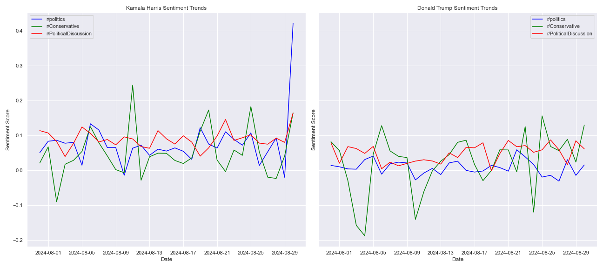
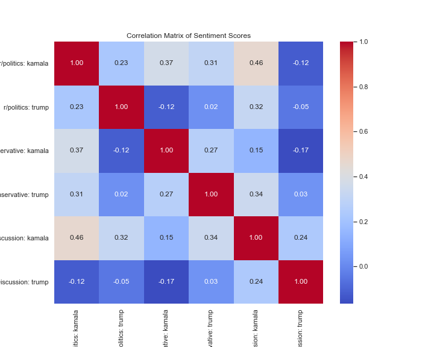

# Reddit Sentiment Trend Analysis

The **Reddit Sentiment Trend Analysis** project aims to analyze and visualize sentiment trends related to political figures on Reddit. This project utilizes sentiment analysis techniques to evaluate sentiments towards Kamala Harris and Donald Trump across various subreddits and plots the sentiment trends and correlation matrices.

## Usage
1. Clone the repository.
2. Run `pip3 install -r requirements.txt`.
3. Get your credentials from [Reddit](https://www.reddit.com/prefs/apps) and add them to `credentials.py`.
4. Edit `config.py`.
5. Run `python main.py`.
   

